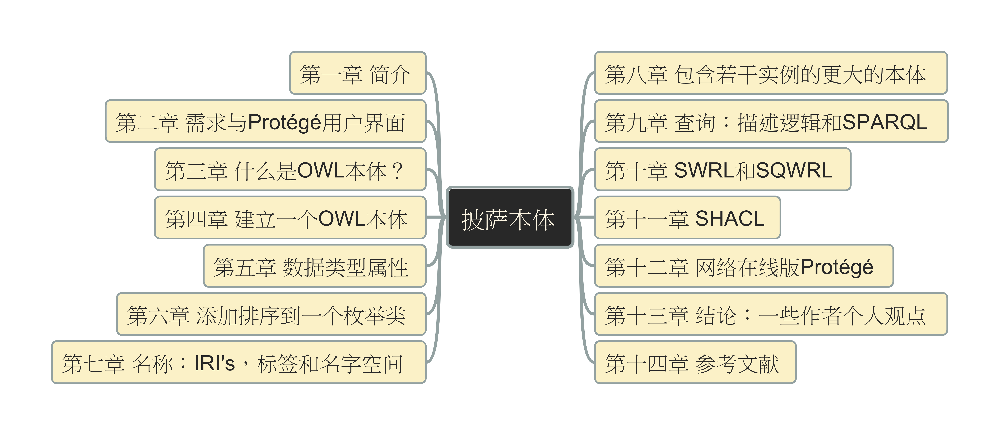

# OWL Ontology (本体) Pizza.owl (中文版) 学习与建模实践

这是pizza.owl的本体模型教程的中文版本与建模实践的源码仓库，《Pizza Tutorial》是一款声名远扬的教程，其主要用途在于助力学习者研习本体（Ontology）理论，同时提供使用Protégé（本体编辑器）进行实操练习的机会。

你可以在这里找到作者Michael DeBellis针对新版pizza.owl教程的推文：[New Protégé Pizza Tutorial](https://www.michaeldebellis.com/post/new-protege-pizza-tutorial)

2023年，我有幸研读《Pizza Tutorial》这一教程。在学习过程中，我将各个建模步骤精心录制，制作成系列视频。起初，这些视频被发布于YouTube平台供众人分享。

时光荏苒，两年的岁月悄然流逝，这些视频累计收获了超五万次的观看量。同时，我也收到众多观众朋友提出的问题。鉴于此，我陆陆续续地将这些视频发布到其他平台，以飨更多的朋友，如下：

- [YouTube: Ontology Practice - Build pizza.owl in Protégé](https://www.youtube.com/playlist?list=PL6DEHvciXKeUx4P32B3hKMK1t6mC8RhsW)
- [抖音： 使用Protege建立Ontology](https://www.douyin.com/video/7298014998062714121)
- [bilibili: Ontology Practice - Build pizza.owl in Protégé](https://space.bilibili.com/158390142/lists/2469670?type=season)

对应版本的GitHub建模仓库是：https://github.com/yasenstar/protege_pizza

在国内平台上，我收到不少朋友反馈，指出教程原文为英文，而我的视频内容与解说同样采用英文，这使得观看和理解都存在一定难度。我在过去一段时间学习本体、知识图谱等相关知识，特别是实际使用 Protégé（本体编辑器）进行建模的过程中，也深切感受到纯中文参考资料的匮乏。

因此，我计划从完全中文的视角重新解读这个 pizza.owl 教程的内容，并基于此重新录制全中文的演示视频。我期望通过自己的努力，能为大家分享更便于理解和学习的本体建模理论与工具使用技巧，推动本体和知识图谱概念的进一步发展。

欢迎大家在讨论区提出你的宝贵意见和建议。

## 教程文档

更新的v3.2英文版本你可以在我的英文github仓库中找到（链接上面已经提供），我也复制放到了本仓库的docs目录中，这是[直接链接](./docs/Protege%205%20New%20OWL%20Pizza%20Tutorial%20V3.2.pdf)。

在演示准备的过程中，我会同步将其翻译到中文版本并分章节列出，同时建模的文件也会安装每个示例保存对应的快照，以方便大家学习时可以直接跳转到某一个位置，这个方式是和我处理英文版的演示视频与模型对应关系是一样的。

## 文档结构

## 各章节内容简介

| 章节 | 基本内容 |
| --- | --- |
| [第01章](./第01章/README.md) | 介绍使用许可证，和使用在文档中的相关命名规则 |
| [第02章](./第02章/README.md) | 介绍了文档的需求，并对Protégé的用户界面加以描述 |
| [第03章](./第03章/README.md) | 提供了OWL本体语言的简单描述 |
| [第04章](./第04章/README.md)] | 实际建立一个OWL本体，包含类和对象属性；并使用描述逻辑推理机来检查本体的一致性和对本体类层级进行自动计算 |
| [第05章](./第05章/README.md) | 描述了数据属性 |
| [第06章](./第06章/README.md) | 描述了本地的设计模式，并演示了其中一种模式：向一个枚举类添加排序 |
| [第07章](./第07章/README.md) | 描述了关于OWL实体名称的多种概念 |
| [第08章](./第08章/README.md) | 介绍了基于前面7章建立的披萨本体的扩展版本，后续章节将使用此扩展版本来练习和演示写入规则，进行查询，和定义约束 |
| [第09章](./第09章/README.md) | 介绍了进行查询的两种工具：描述逻辑查询和SPARQL查询 |
| [第10章](./第10章/README.md) | 介绍了语义网规则语言（SWRL），并演示创建SWRL和SQWRL规则 |
| [第11章](./第11章/README.md) | 介绍了形状约束语言（SHACL），并探讨了描述逻辑中的逻辑公理与SHACL中的数据完整性约束的不同 |
| [第12章](./第12章/README.md) | 网络在线版Protégé |
| [第13章](./第13章/README.md) | 谈论了一些结论、想法和观点 |
| [第14章](./第14章/README.md) | 参考文献 |

---

Good Luck!