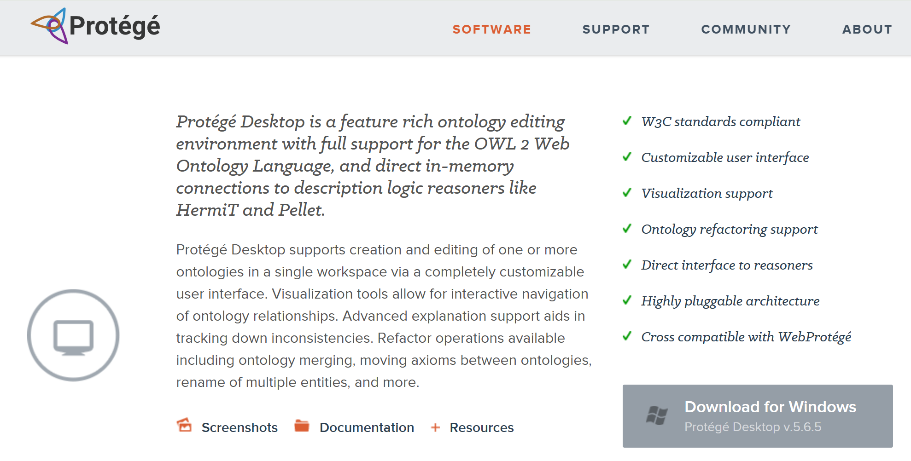
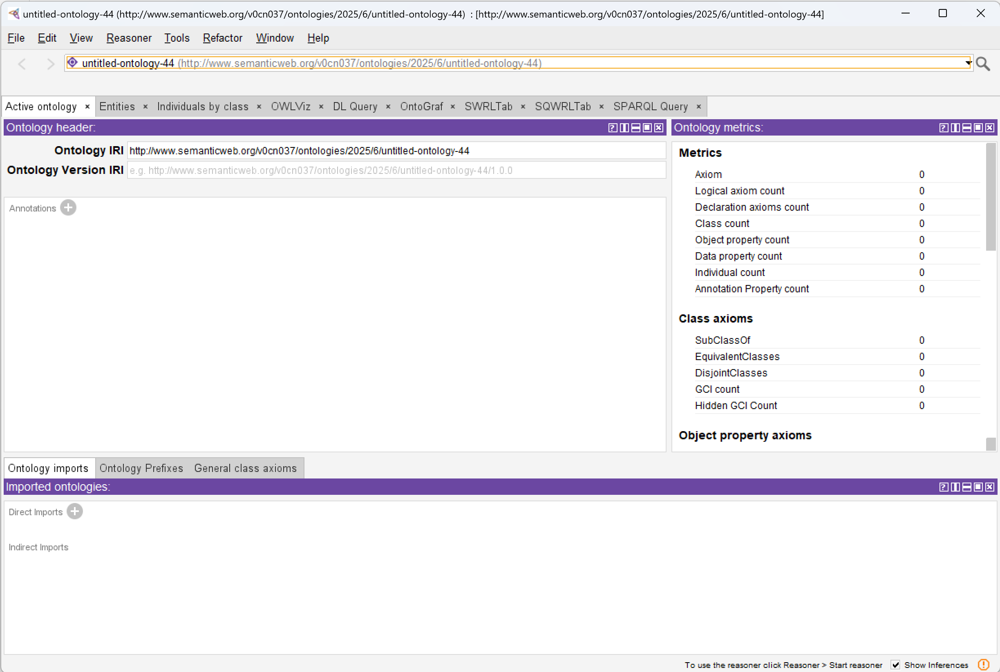
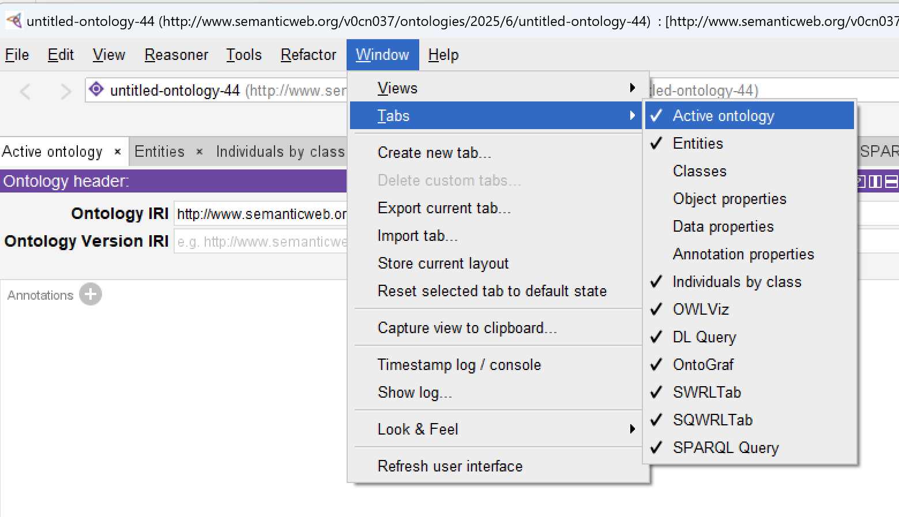
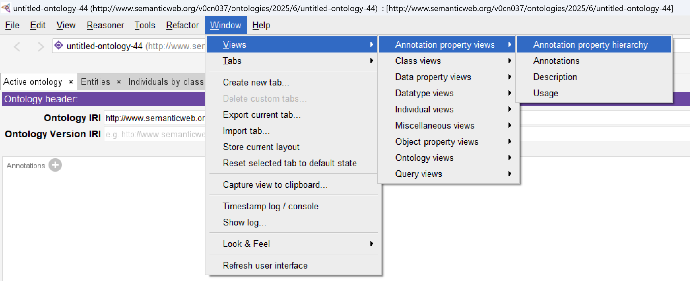

# 第02章 教程的需求与Protégé的用户界面

## 本体建模工具-Protégé

你需要[Stanford's Protégé](https://protege.stanford.edu/software.php)来学习本文档的本体建模，除了下载按照此工具（推荐按照桌面版本），后面章节也会用到某些特定的插件。

现在是2025年7月，最新的Protégé版本是v5.6.5，只要是v5.5以上的对于学习本文档都是可以的。

## Protégé用户界面

Protégé的用户界面分成一系列标签页(tab)，每个标签下面划分成不同的面板(pane)区域。选择`Window>Tabs`可以看到已经选择并显示的标签页：

除了通过在整理选择来显示不同的内置标签页，你也可以通过加载某些插件来显示一些额外的特定标签页。（我们在后面会实际演示）

每个标签页都包含若干不同的面板区域，也称为标签页的视图(view)。每个视图都可以重新调整大小或选择关闭。视图也可以进行嵌套成为子标签页。

这些构成子标签页的视图可以在`Window>Views`菜单项中看到：

---

[<button type="button">«第01章</button>](../第01章/README.md) [<button type="button">第03章»</button>](../第03章/README.md)

[<button type="button">HOME</button>](../README.md)