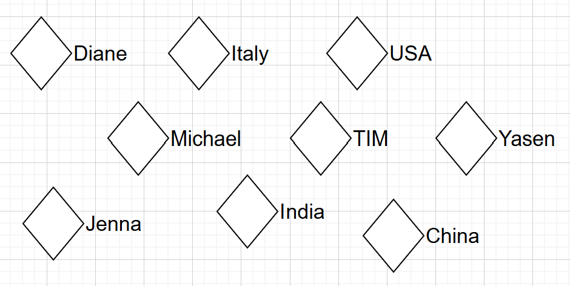

# 第03章 OWL本体的定义

本体(Ontology)用来抓取某些感兴趣领域(domain of interest)的知识。一个本体模型既描述了这个领域中的概念(concepts)，也描述了存在于这些概念直接的关系(relationships)。

不同的本体语言提供了不同的实现方式，在标准化本体语言中最近开发的是出自World Wide Web Consortium (W3C)的OWL - Ontology Web Language。

参考 https://www.w3.org/TR/owl2-primer/ ： OWL是一种语义网语言，设计用来表示关于事物(thing)、事物组以及其中的关系的富和复杂的知识。(Standard definition in English in owl2-primer: The W3C OWL 2 Web Ontology Language (OWL) is a Semantic Web language designed to represent rich and complex knowledge about things)，此文件的本地版本请从[这里](../docs/owl2-primer.pdf)下载。

OWL，基于集合论和逻辑论，使得明确无歧义的对概念进行描述成为可能。复杂的概念可以经由比较简单的概念来逐步建立起来。逻辑模型允许使用推理机，其机制能够检查本体中是否所有的论点和定义都是一致的，并且识别出哪个概念服务于哪个定义。进一步的，推理机可以帮助维护正确的本体层级结构。这个机制特别的对于那些具有多个父类的类的情形非常有帮助。推理机也可以推断出一些额外的信息。例如，如果两个属性是互逆(inversed)的，那么只有其中一个需要用户的断言(assertd)，然后推理机则会自动推断出反向的属性。

## 3.1 OWL本体中的组件

一个OWL本体包含类(classes)，属性(properties)，和个体(individuals)。

- 一个类是一个集合
- 一个属性是一个二元关系
- 一个个体是集合中的一个元素

OWL本体是由描述逻辑(Description Logic - DL)来实现的，DL是一阶逻辑(First Order Logic)的可判定的(decidable)的子集。

其他来自于集合论中的概念也在OWL中有所实现，如不相交的集合(Disjoint set)，空集合(the Empty set - owl:Nothing)，逆关系(inverse relation)，传递关系(transitive relation)，等等。

对集合论中的基本概念有所了解将能够帮助用户理解OWL中的大部分概念，但是这并不是必须的。在这方面，使用Protégé的一个显著的好处是其提供了直观的用户界面来是领域专家们不需要集合论的知识背景就能够定义本体模型。然而，对于开发人员来说，还是希望能够复习回顾一些逻辑论和集合论的知识。

下面的链接中 Overview of Set Theory 的前三章可以作为一个很不错的参考：

https://www.michaeldebellis.com/post/owl-theoretical-basics

这里是[Overview of Set Theory节选的本地版本](Partee%20et%20al.pdf)

### 3.1.1 个体 (Individual)

个体表示所感兴趣领域的对象们。

OWL相比较于大多数编程和知识表示语言的一个很重要的不同点，是OWL不使用唯一名字假设 (Unique Name Assumption - UNA)，这意味着在OWL中允许两个不同的名字指向同一个个体。

举个例子，“伊丽莎白女王 (Queen Elizabeth)”、“女王 (The Queen)”和“伊丽莎白·温莎 (Elizabeth Windsor)”可以（可能）全都指向同一个特定的人（个体）。

在OWL中，要求必须显性地指明多个个体是相同的，或者互相是不同的。

在这个文档中，约定使用空心菱形来表示个体。

下图3.1表示了一个领域中的若干个体，包括人、国家和关系。

图3.1: 个体表示 (Representation of Individuals)

> [!NOTE]
> 个体也被成为实例，并被表示为类的实例。

### 3.1.2 属性 (Property)

属性是在个体之间的二元关系，两个个体通过属性连接在一起。如下图3.2/3.3所示，属性`hasFriend`把个体`Biswanath`连接到个体`Michael`，属性`hasChild`把个体`Michael`连接到个体`Oriana`。

属性可以定义对应的逆属性。例如，属性`hasChild`的逆属性是`hasParent`。

属性可以通过定义来限制只能具有单值，例如，成为函数型(functional)属性。属性也可以是可传递的或对称的。这些有关属性的特征将在后续4.8章节中详细介绍。

图3.2: 属性表示 (Representation of Properties)

> [!NOTE]
> 本体OWL中的属性类似于面向对象编程(OOP)中的属性的概念。然而，要注意到它们之间也具有重要的不同点。其中最为重要的不同是OWL中的属性是独立于类存在的一级实体。OOP的开发者可以参考文档：https://www.w3.org/2001/sw/BestPractices/SE/ODSD/ (本地下载在这里：[A Semantic Web Primer for Object-Oriented Software Developers](../docs/A%20Semantic%20Web%20Primer%20for%20Object-Oriented%20Software%20Developers.pdf))。

### 3.1.3 类 (Class)

OWL中的类是包含个体的集合。类的描述使用对类成员的需求进行了严格(rigorously)定义的正式（数学上）的描述。例如，类`cat(猫)`应该包含在我们感兴趣的领域中的所有可以认为是猫的个体。类可以被组织成为一种超类(superclass)-子类(subclass)的层次结构，也被成为分类法(texonomy)。分类法常常以树(trees)的形式出现，即每个节点都仅有一个父节点，然而，OWL中的类的层级结构没有树的限制，从而可以从直观的(intuitive)角度来表示多重继承结构。

子类专门化(即`are subsumed by`)它们的父类。例如，考虑`Animal(动物)`类和`Dog(犬)`类 -- 犬类可以是动物类的一个子类（所以动物类就是犬类的一个父类）。这也就是意味着 `All dogs are animals (所有的犬都是动物)，All members of the class Dog are members of the class Animal (所有犬类的的成员都是动物类的成员)`。OWL和Protégé提供了一种成为描述逻辑(Description Logic, DL)的语言。DL的一个主要的特性就是这些超类-子类关系(包容关系 subsumption relationship)能够被推理机自动的计算。下面的图3.3显示的是对包含若干个体的类的表示 -- 类用大椭圆形来表示，像是韦恩图 (Venn diagrams) 中的集合。

在OWL的类中，可以通过描述特定的约束以使其中的个体成员要满足的条件得以满足。后续会逐步进行展开描述。

图3.3: 包含个体的类的表示 (Representation of Classes containing Individuals)

---

[<button type="button">«第02章</button>](../第02章/README.md) [<button type="button">第04章»</button>](../第04章/README.md)

[<button type="button">HOME</button>](../README.md)